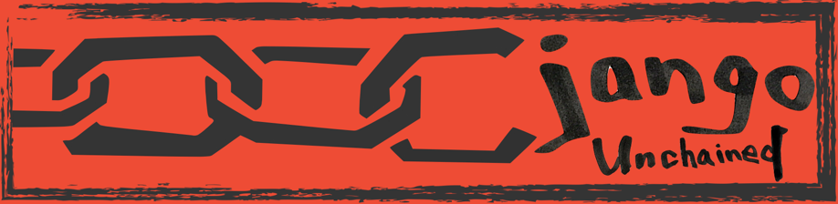
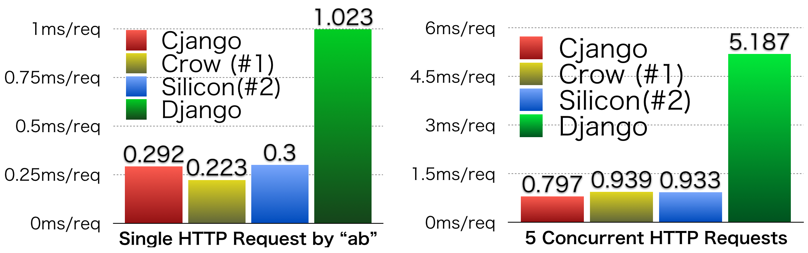

# Cjango-Unchained

Cjango is a high-speed C++ Web framework that provides blazingly fast server responses and [Django](https://github.com/django/django)-like usability.

## Features

### Asyncronous request handling

Cjango handles client requests asyncronously by `select` system calls. Compared to Django, Our benchmark shows 3-5x performance benefits on basic http request handling. Cjango has comparably fast performance with famous C++ web framework projects such as [Crow](https://github.com/ipkn/crow) or [Silicon](https://github.com/matt-42/silicon).

### Regular expression matching for URLs

As in Django, Cjango deal with URL routing by regex matching. All matching rules are written in `url-pattern.json`, which is dynamically loaded into our routing logic and enables **each callback function to be compiled separately from main application**. This is the most notable functionality in Cjango.

### Template file rendering

### HTTP 1.0 Compatibility with Session Support

As of April 2017, Cjango can handle HTTP 1.0 GET/POST requests.

### Detailed debug mode

`make DEBUG=0` disables all debugggin messages and make your application in production mode.

#### Dynamic Callback Loading

In existing C++ web application frameworks, users have to recompile the entire application every time users change View functions (functions).

Cjango solves this issue by leveraging Dynamic Callback Loading functionality. In Cjango, users can modify/add URL-callback hashmaps without any server downtime.

When you change `url-pattern.json` files, cjango detects the file change and dynamically reload your new functions.

##### Changing an existing callback to another function

When your main application is invoked, Cjango automatically spawns a file-monitoring thread. The monotoring thread

##### Adding a new URL pattern with a new function
