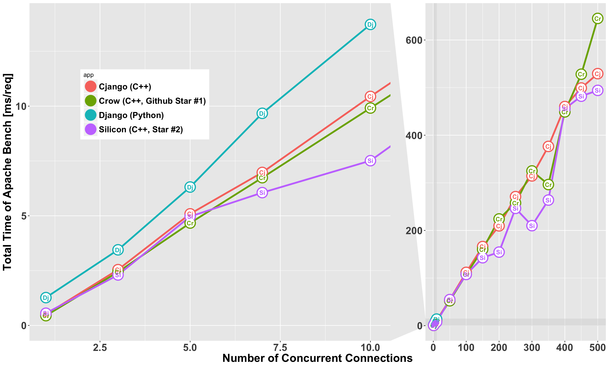

# Results

# Overview

+ Executed the following commands from a client machine
  + `nc=${num}; name=cjango-c${nc}-1; ab -n 10000 -c ${nc} -g ${name}.log http://192.168.0.15:8000/ > ${name}.txt`
  + `${num}` is set as 1, 3, 5, 7, 10, 50, 100, 150, 200, 250, 300, 350, 400, 450, 500
    + Django cannot handle >=15 concurrent requests (`connection reset by peer` error)
    + All C++ libraries cannot handle 200 concurrent requests (the same as above)
  + all raw log files are stored under `bench/ether-ether/`

# Experimental Conditions

#### Server Spec

  + Macbook Pro Mid 2014
    + OS X 10.11.6 (El Capitan)
    + 3GHz Intel Core i7 Dual Core
    + 16GB DDR3 memory

#### Client Spec

  + Windows Machine
    + 2.4Ghz 8cores
    + 8192MB memory
    + 1gbps ether cable (cat6)
    + use ab.exe

#### Network settings
  + (Windows Machine) <- 1Gbps ethernet -> Router <- 1Gbps Ether-Thunderbolt adapter -> Macbook

#### App Framework Settings

  + remove all URL mappings except one (root dir `/` -> a function to print out `"HelloWorld"`)
    + silicon/django uses `/hello/` as URL
  + disable all debugging messages for all app frameworks
  + use the same port (8000)
  + all compiled by the same compiler `Apple LLVM version 7.0.2 (clang-700.1.81)`