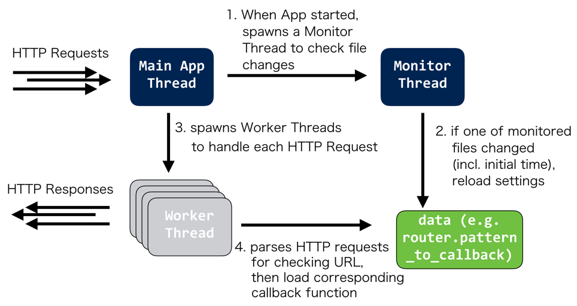
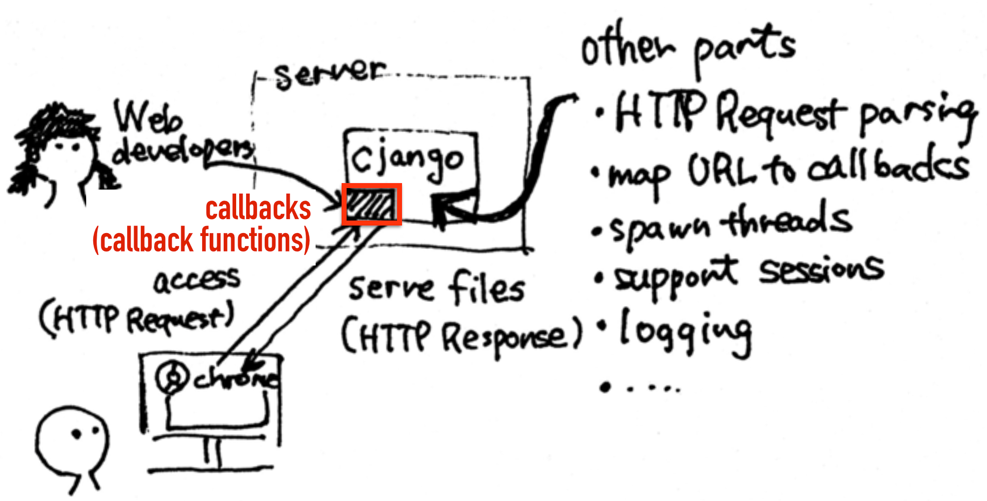

# Overview



Cjango composed of three types of threads: **Main App Thread**, **Monitor Thread**, and **Worker Thread**. **Main App Thread** is the thread spawning other types of threads and getting HTTP requests. Monitor Thread is spawned for checking whether setting

# Design from Web Developer's Viewpoint


When seen from web developers, Cjango provides an Django-like abstraction for web developers. That is, most of the web-developement tasks such as parsing HTTP requests for identifying requested URL, spawning threads for concurrent HTTP requests, or handle HTTP-specific features such as Session are abstracted into easy-to-use APIs.

To put it simply, web developers only have to write **callback functions** (functions getting HTTP requests and generate/return correspoinding HTTP responses). More specifically, writing callback functions and mapping each function to URL by Regular Expression matching, that is almost all of the tasks web developers has to do for making a Web application by using Cjango.

For making the process further easier, we employed **Dynamic Callback Loading** functionality. We'll describe it later in this document.

# Internal API

In general the functionalities are divided into four core modules:

+ `App` ... handler of connections, data transfer and thread spawning
+ `Router` ... handler URL path to function mapping and callback function loading
+ `HttpRequest` ... Http request parser
+ `HttpResponse` ... Http response generator

A typical workflow of handling incoming Http request is: upon request, `App` opens a new client socket and spawns a new worker thread, which calls `Router` to find the corresponding callback function that takes in an `HttpRequest` instance and returns an `HttpResponse` instance, `App` then sends the data back to the client sock.

### Class `App`

Main entry point to run Http server. It provides functions to start a single Http server, listen and accept client connections, handle requests by spawning working threads and transfer data via sockets.

The main public member functions are:

+ `App(Router router)`

Constructor function to populate `App::router` data.

+ `void run(int port)`

Starts Http server socket. Runs forever on the given port, setting up listening socket that polls for client connections. If there is a client connection, calls `handle_request(int client_socket)` to handle the request in a spawned thread. 

The socket operations are not using the popular `boost::asio` library so as to reduce dependencies and keep the library light-weighted. Since there is no socket functions in the C++ Standard Library, the traditional C-style socket is adopted. A wrapper class is provided to wrap the socket so that the resource can be deallocated in the destructor.

For asynchronous connections, sockets are set to be `O_NONBLOCK` and `select()` is used so that the main thread will not be blocked on `accept()`.

+ `int App::handle_request(int client_socket)`

Given a client socket, it reads the raw Http request string from the socket and spawn a new thread by calling `std::thread` that copies the request and socket information for `App::worker()` to get the response.

+ `void App::worker(int client_socket, string request)`

Worker thread function. Creates a HttpRequest object given the raw string, gets callback function by calling `Route::resolve(HttpRequest)` on the newly created Http request object, and sends back a Http response corresponding to the request back to the client socket. The socket is closed after `send()`.

The main public attributes are:

+ `Router App::router`

A `Router` class instance that stores mapping from request paths to handler functions, used by `worker()` to get Http response.

### Class `Router`

Provides mapping from request paths to request handler functions, with dynamic loading feature.

The main public member functions are:

+ `Router(map<string, functor> routes)`

Constructor that calls `Router::add_route()` to populate `Router::pattern_to_callback` and `Router::patterns_list` data.

+ `Router::add_route(string url_pattern, functor callback)`

Callback must have the signature `HttpResponse f(HttpRequest)`. Given a `url_pattern` and a callback functor, we store this pair in `pattern_to_callback` member variable and update `patterns_list`. We throw an error if we are trying to register the same `url_pattern` with different callback functors. Note, `url_pattern` may be a regex pattern or an actual `url_path`.

+ `string Router::resolve(HttpRequest)`

Given a Http request, it returns the `url_pattern` corresponding to the Http request. Example: a request for `"/abc/e"` will return `"/abc/e"`. 

Also allows regex resolution. Example: a `url_pattern` `"articles/([0-9]{4})/([0-9]{2})/$"` is registered, HttpRequest for url path `"articles/2014/12/"` shall return the `url_pattern`. Note that if there are 2 potential matching patterns for a given HttpRequest, we return the first matching pattern found in `patterns_list`.

+ `HttpResponse Router::get_Http_response(HttpRequest)` 

Given a Http request, it returns the corresponding Http response.

The main public attributes are:

+ `Router::pattern_to_callback`

A map that given a `url_path`, returns a callback function corresponding to the `url_pattern`.

+ `Router::patterns_list` 

A vector of patterns, in the exact order of how the user registers the patterns.

Example:

```C++
       Router.add("/abc", some call back);
       Router.add("/efg", some call back);
       Router.add("/xyz", some call back);
       //patterns_list should have the patterns in the order: 
       //["/abc", "/efg", "/xyz"]       
```

### Class `HttpRequest*`
including:

`HttpRequest` `HttpRequestBodyParser` `HttpRequestLine` `HttpRequestParser`

Under namespace `"Http"`. Parses Http requests from string. Supports session using cookies.

The main public member functions are:

+ `HttpRequest (std::string path)`

Constructor function.

+ `std::string HttpRequest::get_method() const`
 
Getter for Http request's method. Ex: `GET`
 
+ `std::string HttpRequest::get_path () const`
 	
Getter for Http request's path. Ex: `/abc.html` 
 
+ `std::string HttpRequest::get_scheme () const`

Getter for Http request's scheme. Ex: `Http/1.0` 
 
+ `unsigned long HttpRequest::get_session_id ()`

Getter for Http request's `session_id`, persisted via cookie mechanism. 
 
+ `bool HttpRequest::has_session_id ()`
 
Check if Http request has a `session_id` associated with it.
 
+ `std::unordered_map< std::string, std::string > const &`
  ` 	HttpRequest::get_meta () const`

Getter for Http request's meta variables in the request header. 
 
+ `std::unordered_map< std::string, std::string > const &`
  ` 	HttpRequest::get_parameters () const`

Getter for Http request's GET/POST parameters.
 
+ `std::unordered_map< std::string, std::string > const & `
  `	HttpRequest::get_cookie () const`
 
Getter for Http request's cookie map.
 
+ `std::shared_ptr< HttpSession > HttpRequest::get_session ()`

Getter for a session object pointer associated with the current Http request 

+ `std::unordered_map< std::string, std::string > `
  `	HttpRequestBodyParser::parse (std::istream &, std::string, int)`

Parses Http request body.

+ `HttpRequest HttpRequestParser::parse_request_line_and_headers`
  ` (std::istream &input_stream)`
 
Given an input_stream containing a http request, parses the request line and headers.
 
+ `HttpRequest HttpRequestParser::parse (std::istream &input_stream)`

Given an input_stream containing a http request, parses the request line, headers, and body.

The main public atrributes are:

+ `std::string HttpRequest::method`

Either `"GET"`, `"POST"`, `"HEAD"`. 
 
+ `std::string HttpRequest::path`

A string representing the full path to the requested page, not including `"http"` or domain. Example: `"/music/bands/the_beatles/"`
 
+ `std::string HttpRequest::scheme`

A string representing the scheme of the request (`http/version` or `https/version`). For simplicity sake, we only support `http/1.0`; thus, scheme is always set to `http/1.0`.
 
### Class `HttpResponse`

Under namespace `"http"`. Generates Http responses.

The main public member functions are:

+ `HttpResponse (std::string)`
 `HttpResponse (std::string, HttpRequest &)`
 `HttpResponse (std::string, std::string)`
 `HttpResponse (int)`
 
Constructor functions.

+ `std::string HttpResponse::to_string ()`
 
Returns a well-formated string version of http response compliant with the http protocol.
 
+ `void HttpResponse::set_cookie (std::string, std::string)`

Given a key value pair, inserts the pair to request's cookie.
 
+ `static HttpResponse HttpResponse::render_to_response (std::string)`

Given a file path, generate a http response.
 
+ `static HttpResponse HttpResponse::render_to_response`
  ` (std::string, std::string)`
 
Given a file path and content type of the file, generate a http response. 
 
+ `static HttpResponse HttpResponse::render_to_response`
  ` (std::string, HttpRequest &)`

Given a file path and a http request, generate a http response. 
 
+ `static HttpResponse HttpResponse::render_to_response`
  `(std::string, std::string, HttpRequest &)`

Given a file path, content type of the file, and a http request, generate a http response.
 
+ `static std::string HttpResponse::get_template (std::string path)`

Given a file path, generate a string containing file's data.

The main public attributes are:

+ `std::string HttpResponse::content`
 
+ `int HttpResponse::status_code`
 
+ `std::string HttpResponse::reason_phrase`
 
+ `std::string HttpResponse::http_version`
 
+ `std::string HttpResponse::content_type`
 
+ `std::unordered_map< std::string, std::string > HttpResponse::headers`
 
+ `static std::unordered_map<int, std::string> HttpResponse::code_to_reason`
 
+ `static std::string HttpResponse::templates_root`

#### Class `HttpSession`

Under namespace `"http"`. Session suppport.

+ `std::string HttpSession::get(std::string)`
 	
Given a key in a session map, return its value. Returns an empty string if key not found.
 
+ `void HttpSession::set(std::string, std::string)`
 	
Given a (key, value) pair, insert it to session map.

### Class `HttpStreamReader`

Under namespace `"http"`. Reads from standard stream.

+ `std::string HttpStreamReader::get_next_line(std::istream &input_stream)`

Given an input stream, returns the current line.

+ `std::string HttpStreamReader::to_string(std::istream &input_stream)`

Given an input stream, converts it to string.
 
+ `std::string HttpStreamReader::read_util`
  `(std::istream &input_stream, int character)`
 
+ `std::string HttpStreamReader::read(std::istream &input_stream, int length)`

Given an input stream and number of length bytes we want to read from the input stream, converts number of length bytes from input stream to a string.
 
+ `void HttpStreamReader::eat_white_space(std::istream &input_stream)`

Removes white spaces from input stream.

### Class `UrlEncodedFormParser`

Under namespace `"http"`. 

The main public member functions are:

+ `std::unordered_map< std::string, std::string >`  
  `UrlEncodedFormParser ::get_parameter`
  `(std::istream &input_stream, int content_leng)`
 	
Given current input stream containing get or post params encoded as a single string, parses it into a map.
 
+ `std::vector< std::string > UrlEncodedFormParser::split (std::string str, char delimiter)

Splits a string by a character delimiter and returns the result as a vector.

### Class `MSocket`

Simple wrapper class of POSIX socket and its operations.

### Class `Selector`

Simple wrapper class of `fd_set` used for `select()` function.


# Dynamic Callback Loading

#### Consideration

At first, we thought to port Django's API as much as possible, and naively assumed that's a straightforward path. That was not the case. We soon found out there are a fairly large amount of design choices for implementing similar functionalities in different languages (for example, Django's `register()` function name is a reserved word for system registers in C++ and we chose the second popular name `add_route()`).

One of such big design issues is how to handle callback functions. **Callback functions** (callbacks) are the functions that handle coming HTTP requests and generate/return appropriate HTTP responses. Since writing new callbacks or updating existing callbacks are one common task in web developement, designing a confortable workflow for writing callbacks would cut a large portion of development stress and time.

In Python's Django, every source file updated at runtime can be reloadable, and updating callback functions are almost trivial.

In existing famous C++ web application frameworks, however, users have to recompile the entire application every time they change callbacks. All callbacks are defined in application routing logic, and cannot be loadable to a running app. We investigated three famous C++ frameworks (Crow, Silicon, and Treefrog) and confirmed all of the three have to recompile an app.

Cjango solves this issue by leveraging C's [Dynamic Loading](https://en.wikipedia.org/wiki/Dynamic_loading) functionality. In Cjango, **users can modify/add URL-callback hashmaps and callbacks without any server downtime**. All URL-to-callback mappings are written in `callbacks/urls.json`, which corresponds to `ursl.py` in Django. When you change the `urls.json` file, a special cjango thread which monitors the files detects the file change and dynamically reload user's new callbacks. This runtime configuration techinique is inspired by a 3D C++ racing game [HexRacer](http://elfery.net/projects/hexracer.html) which employs text configuration files as dynamic loading triggers. We will explain this Dynamic Callback Loading later with examples.


#### Example 1: Changing an existing callback to another function

When your main application is invoked, Cjango automatically spawns a file-monitoring thread by `spawn_monitor_thread()` before entering an http request handling event loop. The monotoring thread checks the `callbacks/urls.json` change for every one second by `App::monitor_file_change()`, and if it's changed, reloading the routing file to update callback hashmaps by `Router::load_url_pattern_from_file()`.

Note that if the specified `.so` file is not located to the path, Cjango instead loads a default callback function which returns `500 Internal Server Error` on web browsers and generates a debug message on a terminal.

Suppose you defined `render_with_db_fast` and `render_with_db_fast_v2` in your `callbacks/db-access.cpp`. If your callback function is written in a single file, you can compile your callback function  without writing one line of Make commands.

```bash
$ ls
db-access.cpp

$ make
g++ -std=c++1z -Wall -fPIC -c db-access.cpp
g++ -std=c++1z -Wall -shared -o db-access.so db-access.o -lhttp_response -lhttp_request

$ ls
db-access.cpp    db-access.o   db-access.so
```

Then, let's modify your `urls.json` from

```json
{
  "/booklist" : {
    "file" : "callbacks/db-access.so",
    "funcname": "render_with_db_fast"
  }
}

```

to

```json
{
  "/booklist" : {
    "file" : "callbacks/db-access.so",
    "funcname": "render_with_db_fast_v2"  # updated
  }
}
```

Right after you saved the `urls.json`, the aforementioned monitoring thread detects the change and automatically reloads your `render_with_db_fast_v2` callback function. You don't need a hassle to `make` an entire application -- just 2 characters change.

If you're a traditional C++ programer, you can also store old callback functions by shared object version numbers (e.g. `db-access.so.0.1` or `db-access.so.0.2`) and make a soft link to `db-access.so`.

##### URL Mapping files

System-wide URL mappings are written in `Cjango-Unchained/urls.json`, but users can also prepare per-app URL mappings. For example, the two example applications have each URL mapping file in the following path:       

+ `Cjango-Unchained/apps/http-get-demo/json/urls.json`  
+ `Cjango-Unchained/apps/http-post-demo/json/urls.json`

Where these `urls.json` are located is specified by `CALLBACKS` parameter in `setting.json`, which corresponds to `settings.py` in Django.

#### Example 2: Updating an existing callback to its newer version (with same name)

Since the file-monitoring thread just checks **the url-mapping file**, it's possible that the thread doesn't notice **the shared object file change** after you update your callback function. However, the solution is simple -- just to enable commented-out `touch urls.json` command. `touch` changes the `urls.json`'s recent modification time, and then Cjango can notice its change.

Internally, each object file is managed by reference counting. That means if users use the above `touch` trick, the file reference count has to be set as zero first and be increased later. Otherwise, only the old function can be referenced. This handling is performed in `Router::load_callback()`.


##### Error handling (invalid callbacks)

+ **Case 1: Typo in callback file/function name (non-existent callbacks)**. These cases are thrown as invalid function specified error in debug mode, and `500 Internal Server Error` in production mode.
+ **Case 2: No URL pattern match**. These cases are `404 Not Found` error on browser and warning message on console.

##### Dynamic Loading Internals: Casting

While Dynamic Loading is a powerful feature, it has to deal with any kind of types ranging from a function pointer of `double square_root(double)` to an object of `MyOriginalClass`. Therefore, it is natural that the type of returned symbol is by default a general pointer `void *`, and users need to cast the generic pointer to a corresponding type. We enclosed type-unsafe code region in just one function `Router::load_callback()`. This function returns a functor type `std::function<http::HttpResponse(http::HttpRequest)>` which is already casted within the function in order to maximize type safety.


# Performance Evaluation

### Experimental Settings

+ Execute Apache Bench command (`ab` Version 2.3), which is one of common HTTP benchmark tools.

| Server | Macbook Pro Mid 2014 | OS X 10.11.6 (El Capitan) | 3.0GHz 2 cores Core i7 | 16GB DDR3 Memory |
|:------:|:--------------------:|:-----------------------:|:----------------------:|:----------------:|
| Client |    Windows Laptop    |    Windows 7 (64bit)    | 2.4GHz 8 cores Core i7 |  8GB DDR3 Memory |
+ [Clt] -- 1Gbps CAT6 ethernet -- Router -- 1Gbps CAT6 Ether-Thunderbolt adapter -- [Srv]

### Experiments

Executed the following commands on the client machine.

+ `ab -n 10000 -c ${nc} -g ${name}.log http://192.168.0.11:8000/ > ${name}.txt`
  + This command sends HTTP requests to the specified IP address repeatedly.
  + `-n` is the total number of HTTP requests to send
  + The number of concurrency `${nc}` is set as 1, 3, 5, 7, 10, 50, 100, 150, 200, 250, ..., 500
	  - Django cannot handle >10 concurrent requests (performance degraded significantly) and stopped there
	  - all raw log files are stored under `Cjango-Unchained/src/bench/ether-ether/`

+ A simplest html file which just contains "\<html>HelloWorld\</html>" is served
  - all debug messages are disabled (cjango, django)
  - enabled optional multithread functionality (crow)
  - the number of URL pattern rules are fixed as 1 (all)

### Results


The x-axis is the number of concurrent HTTP requests (`nc`) and the y-axis is the average response time of **each bundle of** concurrent HTTP requests. In other words, if the target library scales well for large number of requests, the points will be roughly located on a straight line. The left zoomed graph shows **Cjango constantly outperforms our benchmark, Django.** As a conservative comparison, Cjango achieves more than **20% (= 11.2ms / 14.4ms) improvement for 10 concurrent requests**.

Moreover, the right graph shows that **our library can perform cómparably with other popular (Crow and Silicon are both 1000+ stared Github projects) C++ web app framework libraries** up to 500 concurrent requests. Overall, the fastest framework is [Silicon](https://github.com/matt-42/silicon) (high-speed Web API framework), which uses GNU's high-performant [libmicrohttpd](http://www.gnu.org/software/libmicrohttpd/) as backend.

These graphs support that **our design choices of original HTTP parser, original asynchronous request handler, and unique dynamic callback loader have zero or negligible performance losses**.

